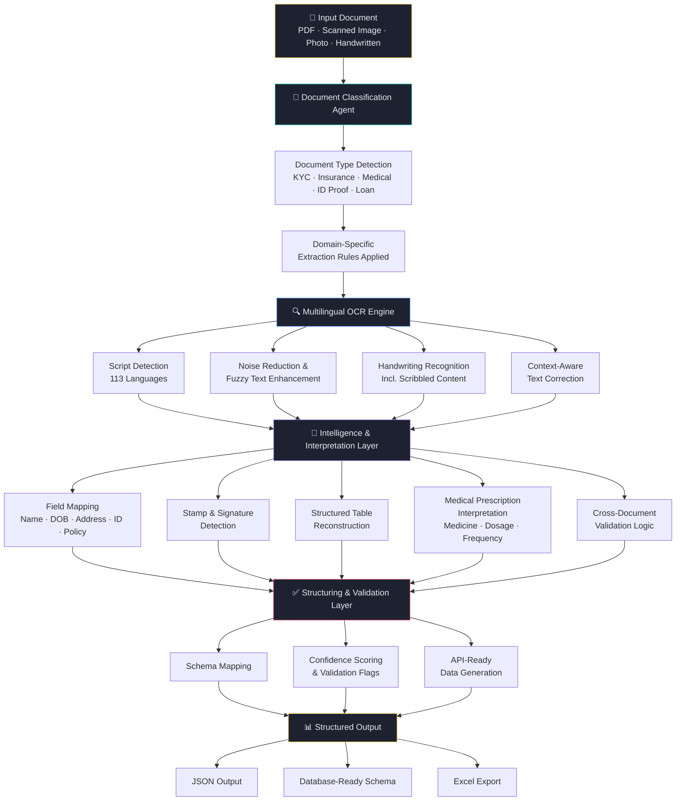

# 📄 Document Digitization
### Agentic OCR Accelerator for Multilingual, Structured & Intelligent Data Extraction

> Goes beyond traditional OCR — understands context, interprets handwriting, detects stamps and signatures, and extracts domain-intelligent data from complex real-world documents.


> 🔒 **This is a private repository.** Source code is not publicly accessible. This README documents the system architecture, capabilities, and business impact.

---

## 📌 Overview

Traditional OCR systems fail on real-world documents — handwritten forms, low-quality scans, multilingual content, stamps, and domain-specific medical prescriptions all break basic text recognition pipelines.

Document Digitization is an **agentic AI OCR accelerator** that doesn't just read text — it understands document type, applies domain-specific extraction logic, interprets handwritten and fuzzy content, detects stamps and signatures, and produces structured, validated, system-ready outputs.

Validated across **English, Marathi, Kannada, and Gujarati**, with support for up to **113 languages**, it is built for KYC, insurance, financial services, and healthcare document workflows at enterprise scale.

---

## 💼 Business Problem

| Challenge | Impact |
|---|---|
| Handwritten and low-quality scanned forms | Traditional OCR fails completely |
| Multilingual customer documents | Inconsistent extraction across scripts |
| Stamps, seals, and signatures embedded in forms | Missed or misread as noise |
| Fuzzy or low-resolution text | High error rates in extraction |
| Complex structured tables in forms | Data lost or incorrectly parsed |
| Aadhaar, PAN, loan, and ID documents | Field-level extraction unreliable |
| Doctor's handwritten prescriptions | Completely unreadable by standard OCR |

---

## ✅ What Document Digitization Does

- **Classifies** document type automatically (KYC, insurance, medical, ID proof)
- **Extracts** typed and handwritten content with domain-aware intelligence
- **Detects** stamps, seals, and signatures
- **Reconstructs** structured tables from complex forms
- **Interprets** medical prescriptions — medicines, dosage, frequency
- **Outputs** structured JSON, database-ready schema, and Excel exports
- **Validates** outputs with confidence scoring and cross-field checks

---

## 🏗️ Agentic Architecture



---

## 🧱 Technical Stack

| Layer | Technology |
|---|---|
| **OCR Engine** | Tesseract, EasyOCR, PaddleOCR |
| **Handwriting Recognition** | Custom HTR model |
| **Language Support** | 113 languages via multilingual models |
| **Document Classification** | Fine-tuned vision + text classifier |
| **Table Extraction** | Camelot, pdfplumber, custom grid detector |
| **Stamp / Signature Detection** | OpenCV + custom CNN detector |
| **Medical NLP** | Domain fine-tuned LLM (prescription intelligence) |
| **Structured Output** | Pydantic schema, JSON, openpyxl |
| **API Layer** | FastAPI |
| **Deployment** | On-premise / Private Cloud / Docker |

---

## 🎯 Core Capabilities

### 1️⃣ Multilingual Intelligent OCR
- Supports up to **113 languages** including regional Indian scripts
- Validated on **English, Marathi, Kannada, Gujarati**
- Handles mixed-language forms (e.g., English + regional script on the same page)
- Context-aware correction reduces misread characters

### 2️⃣ KYC & Insurance Form Intelligence
- Field-level extraction: Name, DOB, Address, ID numbers, Policy details
- Handles both **typed and handwritten** form fields
- **Signature detection** — isolates and flags signature regions
- **Stamp/seal detection** — identifies official stamps as distinct entities
- Fuzzy text enhancement for low-quality scans
- Structured table extraction from multi-column forms

### 3️⃣ Supporting Document Extraction
- **Aadhaar card** — name, DOB, address, UID extraction
- **PAN card** — name, PAN number, DOB extraction
- **Loan documents** — identity fields, financial terms, signatures
- Cross-field validation logic (e.g., DOB consistency across documents)
- ID-validation-ready structured outputs

### 4️⃣ Healthcare Intelligence Layer
Purpose-built for medical document complexity:
- **Handwritten prescriptions** — medicine names, dosage, frequency, duration
- **Discharge summaries** — diagnosis, treatment, follow-up instructions
- **Hospital bills** — line-item extraction, billing codes, totals
- Interprets tablet symbols, abbreviations, and medical shorthand
- Handles semi-structured and completely unstructured medical content

### 5️⃣ Structured Output Generation
- **JSON** — field-level structured output with metadata
- **Database-ready schema** — directly insertable into enterprise databases
- **Excel exports** — for operations and compliance teams
- **Confidence scoring** — per-field accuracy estimates
- **Validation flags** — highlights low-confidence or inconsistent fields

---

## 📊 Business Impact

| KPI | Result |
|---|---|
| Manual Data Entry | **↓ 70–90% reduction** |
| Document Processing Time | **Reduced drastically** |
| Extraction Error Rate | **Lower via validation and confidence scoring** |
| KYC & Claims Turnaround Time | **Significantly faster** |
| Operational Cost | **Significant reduction** |
| Scalability | **Multi-regional, multilingual deployment** |

---

## 🏭 Use Case Coverage

| Industry | Use Cases |
|---|---|
| **Banking & Financial Services** | KYC processing, loan document parsing, identity verification |
| **Insurance** | Policy issuance, claims processing, form digitization |
| **Healthcare** | Prescription digitization, discharge summary extraction, hospital billing |
| **Government** | ID document processing, public records digitization |
| **Enterprise Onboarding** | Multi-document identity and compliance workflows |

---

## 🔑 Key Differentiators

- **Agentic workflow** — classifies, routes, and extracts intelligently, not just OCR
- **113 language support** — true multilingual capability including Indian regional scripts
- **Handwriting & scribble understanding** — handles real-world messy documents
- **Stamp and signature detection** — treats official markings as structured entities
- **Medical domain intelligence** — prescription and billing extraction beyond generic NLP
- **High accuracy on low-quality scans** — noise reduction and fuzzy text enhancement built-in
- **Structured, validated outputs** — confidence scoring and cross-field validation at every step

---

## 🚀 Deployment Model

```
┌──────────────────────────────────────────────────┐
│     Document Digitization Deployment             │
│                                                  │
│  ✅ On-Premise Server                            │
│  ✅ Private Cloud (AWS / Azure / GCP)            │
│  ✅ Docker containerized                         │
│  ✅ API-first integration                        │
│                                                  │
│  Integrations:                                   │
│  → KYC & Onboarding Platforms                   │
│  → Insurance Claims Systems                     │
│  → Hospital Management Systems (HMS)            │
│  → Core Banking / Loan Origination Systems      │
│  → Enterprise Document Management (DMS)         │
│                                                  │
│  Output Formats:                                 │
│  → JSON (API-ready)                             │
│  → Database-ready schema                        │
│  → Excel / CSV exports                          │
└──────────────────────────────────────────────────┘
```

---

## 🔒 Privacy & IP Notice

This repository contains proprietary source code, domain-trained models, and enterprise document processing pipelines. The code, extraction logic, and model weights are **not publicly accessible**.

If you are a recruiter, collaborator, or evaluator and would like a walkthrough or demo, please reach out:

📧 [paularpitaseis@gmail.com](mailto:paularpitaseis@gmail.com)
🔗 [LinkedIn — Arpita Paul](https://www.linkedin.com/in/dr-arpita-paul-575708135/)

---

## 👩‍💻 Author

**Arpita Paul** · Senior Data Scientist · GenAI & LLM Specialist
*From Seismology to GenAI 🚀 | NuSummit | Mumbai*

[](https://github.com/ArpitaAI-collab)
[](https://linkedin.com/in/yourprofile)

